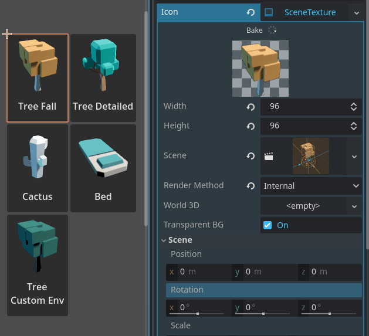

# SceneTexture - Icon/Thumbnail Generation

A texture that uses a 3D scene to draw itself. Generate icons and thumbnails directly from a scene and use them anywhere that accepts a regular texture resource.

## Installation and How to Use

- Automatic: Install it from the [Godot Asset Library](https://godotengine.org/asset-library) in the `AssetLib` tab in the Godot editor.
- Manual: Download the source code and copy the `addons` folder into your project folder.

Make sure the plugin is activated in `Project > Project Setting > Plugins`.  
Create a new `SceneTexture` resource anywhere that takes a `Texture2D`, like a button icon. Set the scene to render and configure.

## Features

- Use anywhere that takes a regular texture like buttons and materials. It is just an extension of `Texture2D`.
- Real-time bake preview in the inspector.
- Use a simple default render for fast baking or Godot's built-in render supporting `Environment` features like global illumination.
## License

Create by ydeltastar - MIT License.  
Assets in the demo by Kenney ([Nature Kit](https://kenney.nl/assets/nature-kit)) - Creative Commons CC0.
